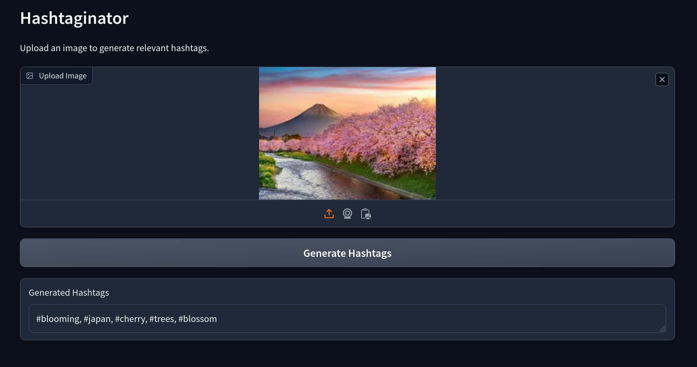

# Hashtaginator

Hashtaginator is a web application that generates relevant hashtags for uploaded images using a pre-trained image captioning model. The application is built using Gradio for the user interface and Hugging Face Transformers for the image captioning model.



## Installation
```bash
git clone https://github.com/manavsu/hastaginator.git
cd hashtaginator
```

## Usage

### Run locally
1. Create a virtual environment and activate it:
    ```bash
    python3 -m venv .venv
    source .venv/bin/activate
    ```

2. Install the required dependencies:
    ```bash
    pip install -r requirements.txt
    ```
3. Run the application:
    ```bash
    python app.py
    ```

### Docker
1. Use docker compose to build and run
    ```bash
    docker compose up
    ```

Next Open your web browser and go to `http://0.0.0.0:7860` and upload an image and click the "Generate Hashtags" button to get relevant hashtags.

## Project Structure

- `app.py`: Contains the Gradio interface setup.
- `image_cap.py`: Contains the logic for generating hashtags from images.
- `requirements.txt`
- `readme.md`
- `Dockerfile`
- `docker-compose.yml`
- `filler_words.txt` - A list of words that are filtered from the list of hashtags.

## License

This project is licensed under the GNU GPL. See the [LICENSE](LICENSE) file for details.